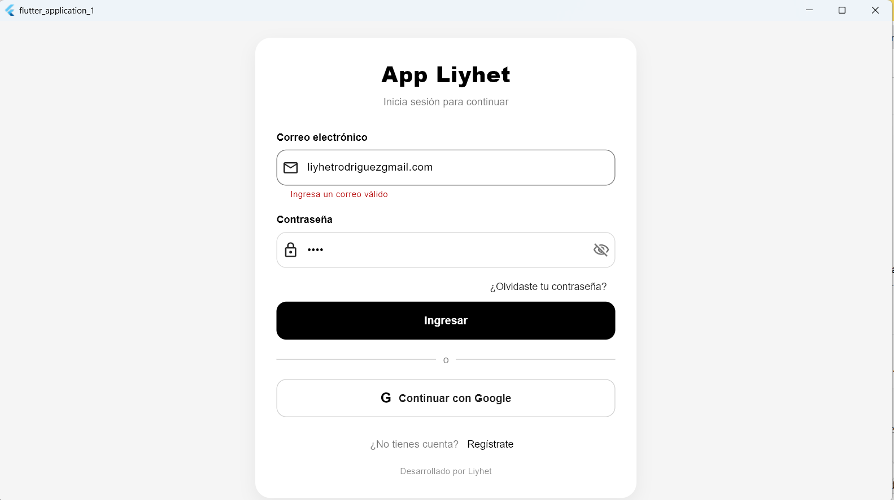
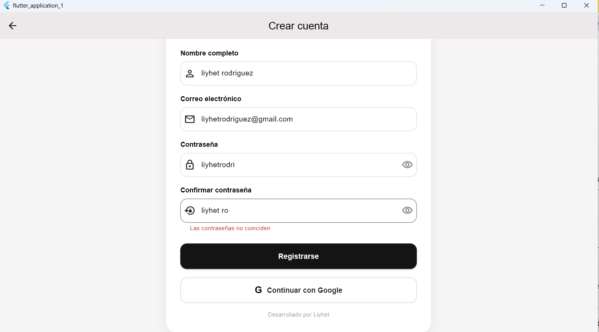
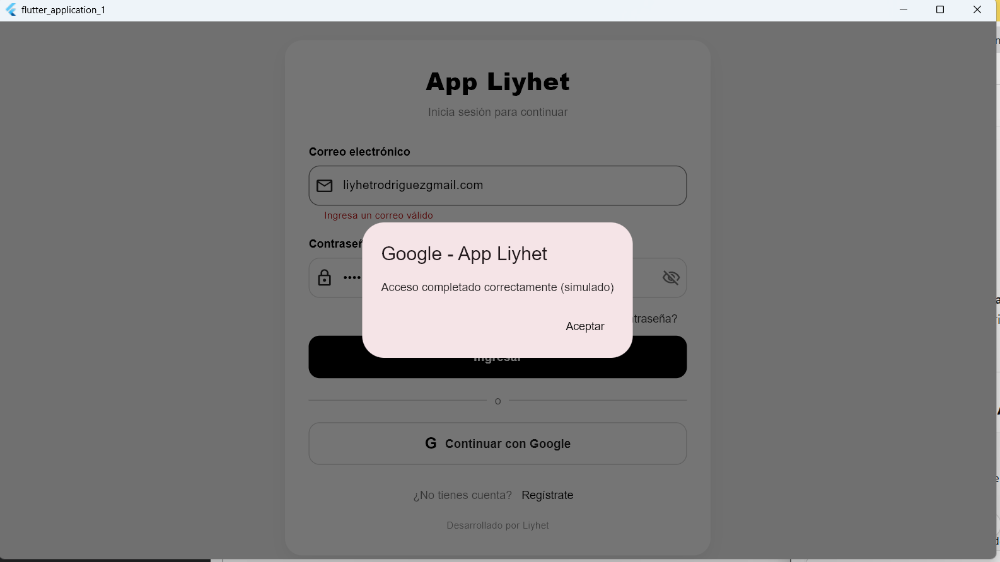
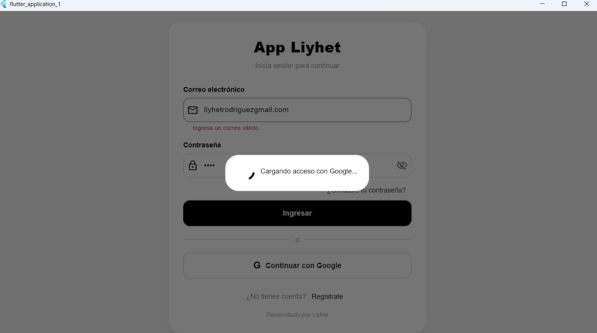

# Taller de autenticación en Flutter

Proyecto frontend desarrollado en Flutter que implementa un flujo completo de autenticación con pantallas de inicio de sesión, registro y recuperación de contraseña.

El diseño es responsivo y utiliza una interfaz minimalista en blanco y negro.

---

## Flujo de pantallas

### Desde iniciar sesión

**Iniciar sesión → Registrarse**  
Crear una nueva cuenta.

**Iniciar sesión → Olvidé mi contraseña**  
Recuperar contraseña.

---

### Desde registro

**Registrarse → Iniciar sesión**  
Redirección al inicio de sesión después de registrarse correctamente.

---

### Desde recuperación de contraseña

**Olvidé mi contraseña → Iniciar sesión**  
Retorno al inicio de sesión después de enviar el enlace.

---

## Capturas de pantalla

### Pantalla de login



---

### Pantalla de registro



---

### Acceso con Google



---

### Carga de Google



---

## Cómo ejecutar el proyecto

```bash
git clone https://github.com/LiyhetRodriguez/TALLER-V2.git
cd TALLER-V2
flutter pub get
flutter run